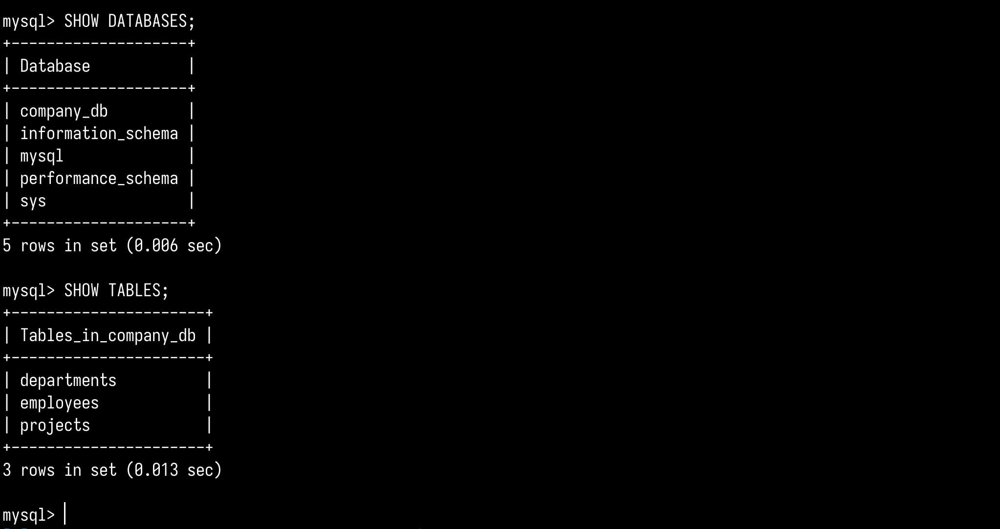
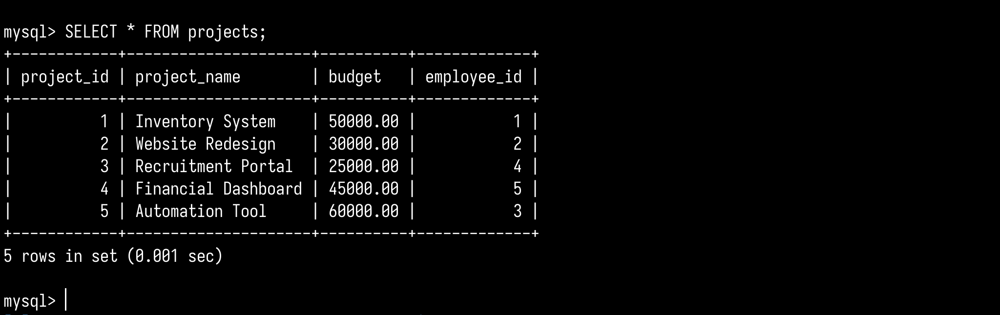
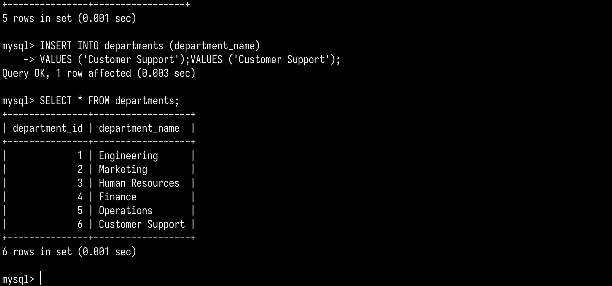
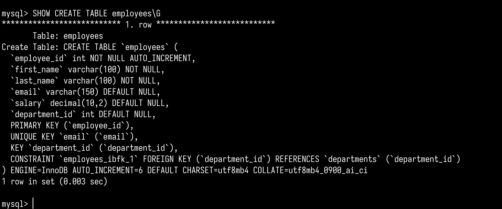

# mongoDBA classworks

Submission by **Arunava Ghosh (24BCG10121)**

#### quick start

```bash
brew install mysql
brew services start mysql
mysql -u root -p

# run mysql files
SOURCE schema.sql;
SOURCE insert_data.sql;
SOURCE crud_queries.sql;
```

#### screenshots 


<!--  -->
<!--  -->
<!--  -->
<!--  -->

<!--  -->
<!--  -->


## disclaimer

This is my coursework. Do not copy it. Submitting any part of this as your own work is academic misconduct and I will report it to my university without hesitation. The consequences are yours to deal with.
