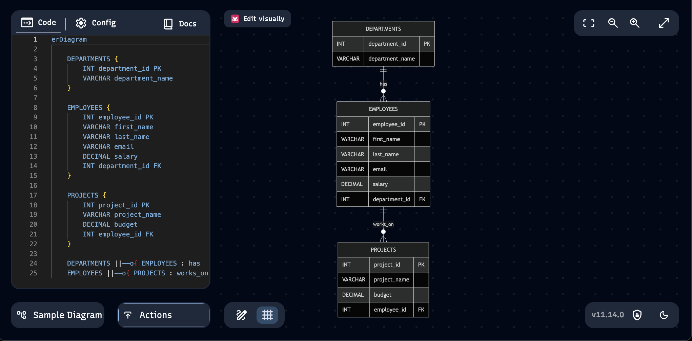
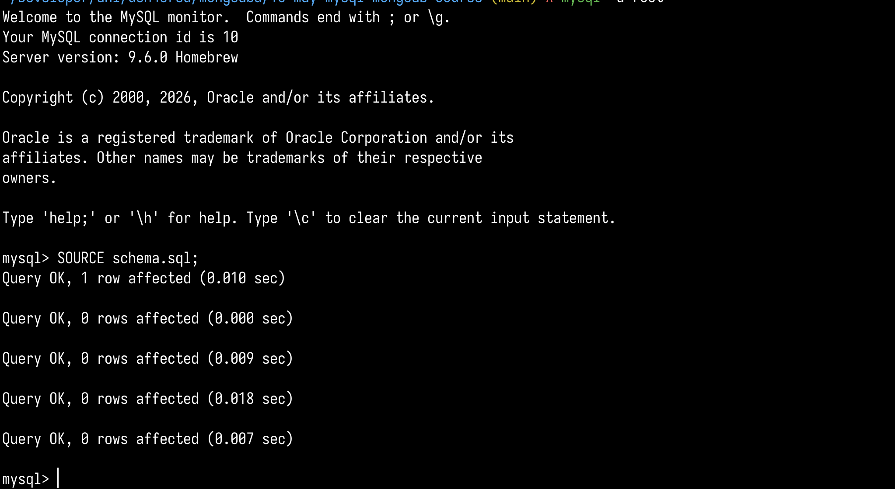
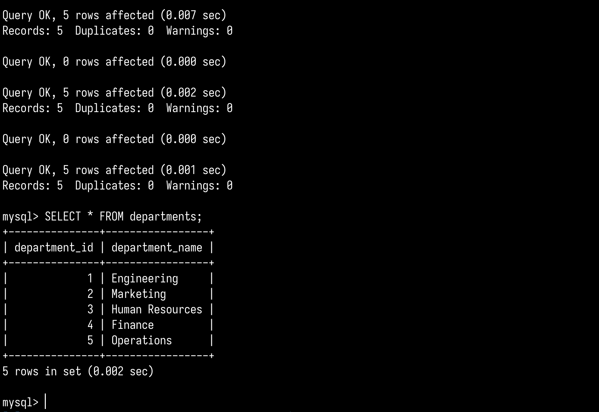
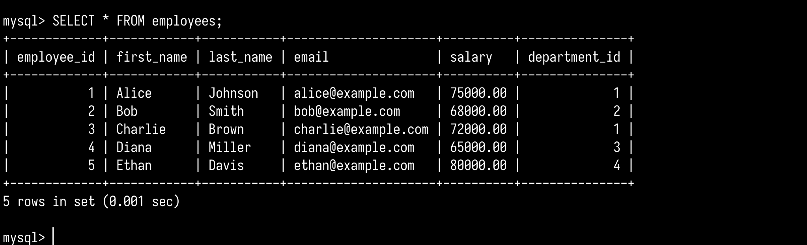

# mysql assignment

Submission by Arunava Ghosh (24BCG10121)

#### quick start

```bash
brew install mysql
brew services start mysql
mysql -u root -p

# run mysql files
SOURCE schema.sql;
SOURCE insert_data.sql;
SOURCE crud_queries.sql;
```

#### screenshots









